 
# ⚡ Minecraft Best Enchantments & Application Order (Efficient XP Use)

This guide compiles the video instructions into a **visual** Markdown file with step-by-step anvil order and XP totals so you save levels.
Source: https://www.youtube.com/watch?v=yucggU0rG8o

---

## 🪖 Helmet
**Enchantments:**  
- Protection IV — general damage reduction  
- Aqua Affinity — faster mining underwater  
- Respiration III — extends underwater time (~60s)  
- Unbreaking III — durability  
- Mending — repairs with XP

**Efficient application (per video):**
1. Combine **Respiration III + Mending** → *book* (2 XP)  
2. Combine **Protection IV + Aqua Affinity** → *book* (2 XP)  
3. Combine those two books together → *combined book* (8 XP)  
4. Apply **Unbreaking III** book directly to helmet (apply cost included in next step)  
5. Apply the *combined book* to the helmet (this step + previous yields *18 XP* here)  
- **Total (final stated): ~33 XP**

```mermaid
flowchart LR
  R["Respiration III + Mending (Book) — 2 XP"] --> X["Combine both books → Combined Book — 8 XP"] 
  B["Protection IV + Aqua Affinity (Book) — 2 XP"] --> X
  Z["Unbreaking III (Book)"] --> U["Apply Unbreaking III → Helmet (apply step)"]
  X --> Y["Apply Combined Book → Helmet (this & prior stage ≈ 18 XP)"]
  Y --> F["Final Helmet ✅ (Total ≈ 33 XP)"]
```

---

## 🦺 Chestplate
**Enchantments:** Protection IV, Unbreaking III, Mending

**Efficient application (per video):**
1. Combine **Protection IV + Mending** → *book* (2 XP)  
2. Apply **Unbreaking III** → chestplate (3 XP)  
3. Apply combined book → chestplate (8 XP)  
- **Total:** ~13 XP

---

## 👖 Leggings
**Same as Chestplate.**  
- Protection IV + Mending (2 XP) → book  
- Apply Unbreaking III (3 XP)  
- Apply book (8 XP)  
- **Total:** ~13 XP

---

## 👢 Boots
**Enchantments:** Protection IV, Feather Falling IV, Depth Strider III (or Frost Walker II), Soul Speed III, Unbreaking III, Mending

**Video preference:** Depth Strider III (recommended over Frost Walker).  
**Efficient application (per video):**
1. Apply **Mending** directly to boots (Boots + Mending) — *2 XP*  
2. Combine **Depth Strider III + Protection IV** → *book* (4 XP)  
3. Apply that book to boots → *12 XP* (apply step)  
4. Combine **Soul Speed III + Unbreaking III** → *book* (3 XP)  
5. Add **Feather Falling IV** to that book → now (book with Soul Speed + Unbreaking + Feather Falling) — *5 XP*  
6. Combine the two large books (the boots current + the other book) → *25 XP*  
- **Total:** ~51 XP (as stated)

```mermaid
flowchart LR
  M["Boots + Mending (apply) — 2 XP"] --> D["Depth Strider III + Protection IV (Book) — 4 XP"]
  D --> A["Apply Book → Boots (step cost) — 12 XP"]
  A --> S["Soul Speed III + Unbreaking III (Book) — 3 XP"]
  S --> SF["Add Feather Falling IV to same Book — 5 XP"]
  SF --> C["Combine the two big book-sets → Boots — 25 XP"]
  C --> F["Final Boots ✅ (Total ≈ 51 XP)"]
```

---

## 🪽 Elytra
**Enchantments:** Unbreaking III, Mending  
- Order doesn't matter much.  
- **Total:** ~6 XP

```mermaid
flowchart LR
  U["Unbreaking III"] --> E["Elytra"]
  M["Mending"] --> E
  E --> F["Final Elytra ✅ (Total ≈ 6 XP)"]
```

---

## 🛡️ Shield
**Enchantments:** Unbreaking III, Mending  
- Same as Elytra — apply one then the other.  
- **Total:** ~6 XP

```mermaid
flowchart LR
  U["Unbreaking III"] --> S["Shield"]
  M["Mending"] --> S
  S --> F["Final Shield ✅ (Total ≈ 6 XP)"]
```

---

## ⚔️ Sword
**Enchantments:** Sharpness V (or Smite V choice), Sweeping Edge III, Looting III, Unbreaking III, Mending  
*(Fire Aspect II & Knockback II optional — not recommended in this build.)*

**Efficient application (per video):**
1. Combine **Sweeping Edge III + Mending** → *book* (2 XP)  
2. Combine **Looting III + Unbreaking III** → *book* (3 XP)  
3. Combine those two books together (make bigger book) — *10 XP* (ordering matters for cost)  
4. Apply **Sharpness V** to sword (5 XP)  
5. Apply the big combined book → sword (21 XP apply step)  
- **Total:** ~41 XP

```mermaid
flowchart LR
  SE["Sweeping Edge III + Mending (Book) — 2 XP"] --> LUB["Looting III + Unbreaking III (Book) — 3 XP"]
  LUB --> BB["Combine both books → Big Book — 10 XP"]
  BB --> S1["Sword + Sharpness V (apply) — 5 XP"]
  S1 --> S2["Apply Big Book → Sword — 21 XP"]
  S2 --> F["Final Sword ✅ (Total ≈ 41 XP)"]
```

---

## 🏹 Bow
**Enchantments:** Power V, Infinity (recommended over Mending), Unbreaking III (optional: Flame II, Punch II)

**Efficient application (per video):**
1. Combine **Power V + Unbreaking III** → *book* (3 XP)  
2. Add **Infinity** to bow (4 XP)  
3. Apply book → bow (3 XP apply?) — final totals line up to **~17 XP**

```mermaid
flowchart LR
  PB["Power V + Unbreaking III (Book) — 3 XP"] --> I["Apply Infinity to Bow — 4 XP"]
  I --> A["Apply Book → Bow (apply step)"]
  A --> F["Final Bow ✅ (Total ≈ 17 XP)"]
```

---

## 🔱 Trident

### Build A — Channeling + Loyalty (Mob-head build)
**Enchantments:** Channeling, Loyalty III, Unbreaking III, Mending  
**Steps (per video):**
1. Combine **Channeling + Loyalty III** → *book* (3 XP)  
2. Combine **Unbreaking III + Mending** → *book* (2 XP)  
3. Apply Unbreaking+Mending book → Trident (6 XP apply)  
4. Apply Channeling+Loyalty book → Trident (11 XP apply)  
- **Total:** ~22 XP

### Build B — Riptide (movement build)
**Enchantments:** Riptide III, Unbreaking III, Mending  
**Steps (per video):**
1. Combine **Riptide III + Mending** → *book* (2 XP)  
2. Apply **Unbreaking III** to trident (3 XP)  
3. Apply Riptide+Mending book → trident (10 XP)  
- **Total:** ~15 XP

```mermaid
flowchart LR
  RM["Riptide III + Mending (Book) — 2 XP"] --> A["Apply Unbreaking III to Trident — 3 XP"]
  A --> B["Apply RM Book → Trident — 10 XP"]
  B --> F["Final Trident (Riptide) ✅ (Total ≈ 15 XP)"]
```

---

## ☠️ Crossbow
**Enchantments:** Quick Charge III, Piercing IV (recommended) or Multishot, Unbreaking III, Mending

**Efficient application (per video):**
1. Combine **Piercing IV + Mending** → *book* (2 XP)  
2. Combine **Unbreaking III + Quick Charge III** → *book* (3 XP)  
3. Apply both books to crossbow (order flexible)  
- **Total:** ~22 XP

---

## ⛏️ Pickaxe

### Silk Touch Pickaxe
**Enchantments:** Efficiency V, Unbreaking III, Mending, Silk Touch  
**Steps:**
1. Combine **Efficiency V + Mending** — 2 XP  
2. Combine **Silk Touch + Unbreaking III** — 3 XP  
3. Apply to pickaxe (order flexible)  
- **Total:** ~24 XP

### Fortune Pickaxe
**Enchantments:** Efficiency V, Unbreaking III, Mending, Fortune III  
**Steps:**
1. Combine **Fortune III + Mending** — 2 XP  
2. Combine **Efficiency V + Unbreaking III** — 3 XP  
3. Apply combined books to pickaxe (apply steps lead to totals)  
- **Total:** ~26 XP

```mermaid
flowchart LR
  E["Efficiency V + Mending — 2 XP"] --> S["Silk Touch + Unbreaking III — 3 XP"]
  S --> P["Apply to Pickaxe (Silk Touch build) — Final ≈ 24 XP"]
  F["Fortune III + Mending — 2 XP"] --> G["Efficiency V + Unbreaking III — 3 XP"]
  G --> H["Apply to Pickaxe (Fortune build) — Final ≈ 26 XP"]
```

---

## 🪣 Shovel
**Same pattern as Pickaxe.**  
- **Silk Touch build** → ≈ 24 XP  
- **Fortune build** → ≈ 26 XP

---

## 🪓 Axe
**Enchantments:** Efficiency V, Unbreaking III, Mending, Sharpness V (recommended), Silk Touch OR Fortune III

**Efficient application (per video):**
1. Combine **Efficiency V + Mending** — 2 XP  
2. Combine **Sharpness V + Unbreaking III** — 3 XP  
3. Combine those two books together carefully (choose cheaper order) — 9 XP  
4. Apply Silk Touch straight to axe (if wanted) and then apply combined book → overall result  
- **Total (example build in video):** ~37 XP

```mermaid
flowchart LR
  EM["Efficiency V + Mending — 2 XP"] --> SB["Sharpness V + Unbreaking III — 3 XP"]
  SB --> CB["Combine Books — 9 XP"]
  CB --> A["Apply Silk Touch (optional) & Combined Book → Axe"]
  A --> F["Final Axe ✅ (Total ≈ 37 XP for example build)"]
```

---

## 🌾 Hoe
**Enchantments:** Unbreaking III, Mending  
- **Total:** ~6 XP

```mermaid
flowchart LR
  U["Unbreaking III"] --> H["Hoe"]
  M["Mending"] --> H
  H --> F["Final Hoe ✅ (Total ≈ 6 XP)"]
```

---

## ✂️ Shears
**Enchantments:** Efficiency V, Unbreaking III, Mending

**Efficient application (per video):**
1. Combine **Efficiency V + Mending** — 2 XP  
2. Apply **Unbreaking III** → shears (3 XP)  
3. Apply combined book → shears  
- **Total:** ~14 XP

```mermaid
flowchart LR
  EM["Efficiency V + Mending — 2 XP"] --> U["Apply Unbreaking III — 3 XP"]
  U --> A["Apply Combined Book → Shears"]
  A --> F["Final Shears ✅ (Total ≈ 14 XP)"]
```

---

## 🎣 Fishing Rod
**Enchantments:** Luck of the Sea III, Lure III, Unbreaking III, Mending

**Efficient application (per video):**
1. Combine **Luck of the Sea III + Mending** — 2 XP  
2. Combine **Lure III + Unbreaking III** — 3 XP  
3. Combine these two books together (ordering matters) — 10 XP  
4. Apply combined book → fishing rod (apply cost included) — final step  
- **Total:** ~35 XP

---

## 🔥 Flint & Steel
**Enchantments:** Unbreaking III, Mending  
- Apply in either order.  
- **Total:** ~6 XP

```mermaid
flowchart LR
  U["Unbreaking III"] --> FFS["Flint & Steel"]
  M["Mending"] --> FFS
  FFS --> DONE["Final Flint & Steel ✅ (Total ≈ 6 XP)"]
```

---

# ✅ Final Tips (from video)
- **Always combine books first**, then apply to the item. This minimizes exponential XP costs.  
- **Order matters** when combining multiple books — combining small books first is almost always cheaper.  
- For tools like **pickaxe/shovel/axe** keep **two variants** (Silk Touch vs Fortune).  
- For the **bow**, Infinity is usually better than Mending unless you have specialized use.  
- Use the XP totals above as a quick reference when planning big anvil sessions.

---

If your Markdown viewer supports **Mermaid**, these flowcharts will render as diagrams;

Happy enchanting — Senjuro@git

